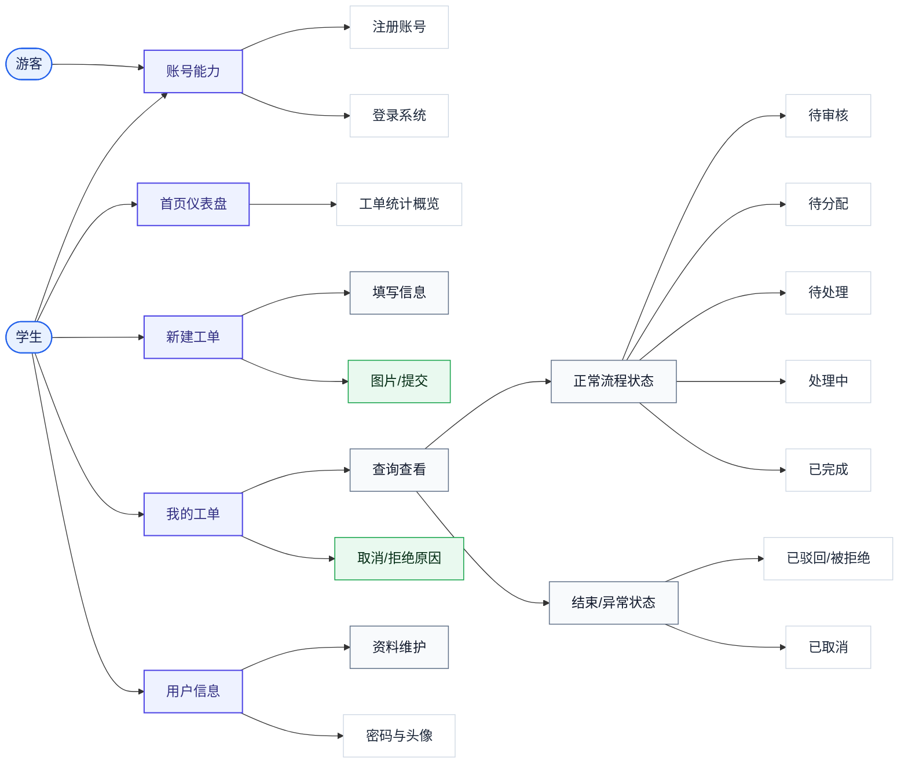
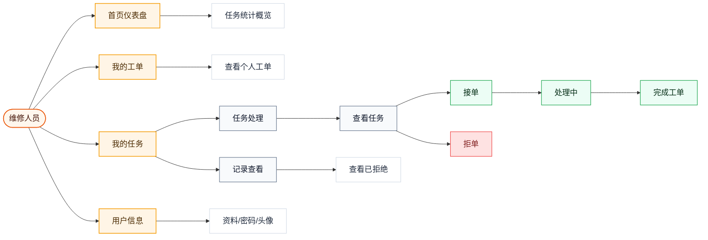
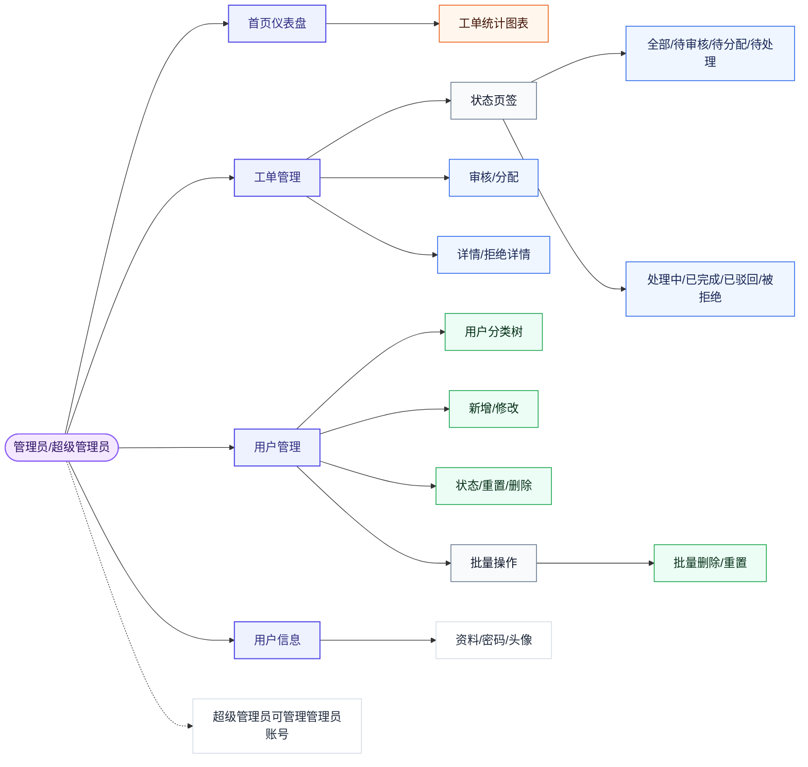
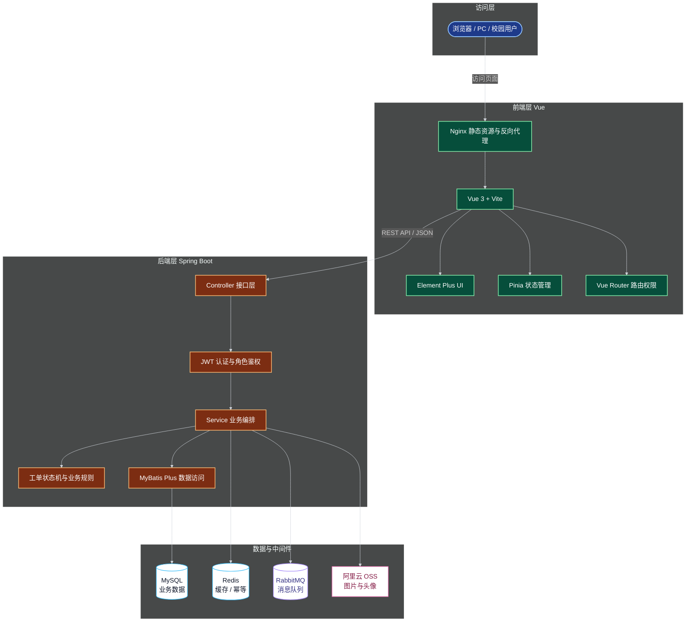
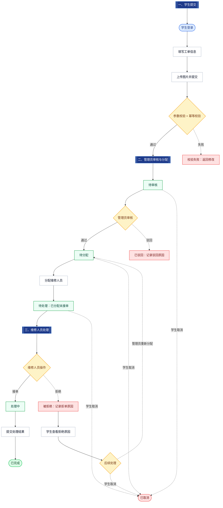
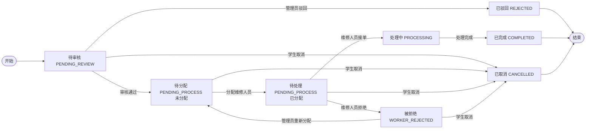
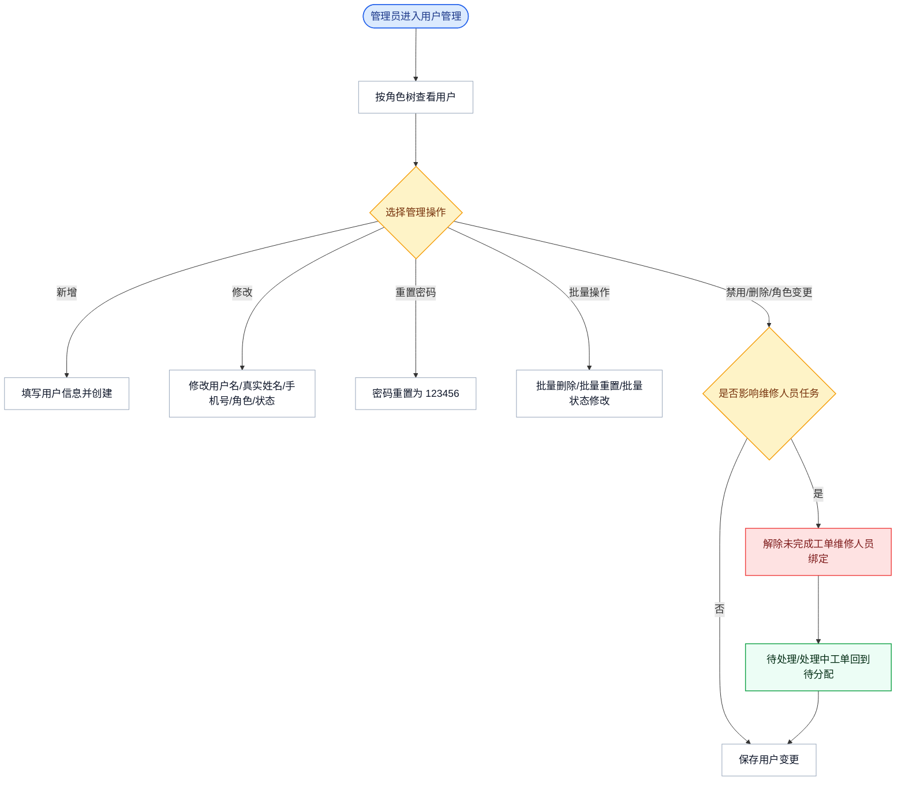
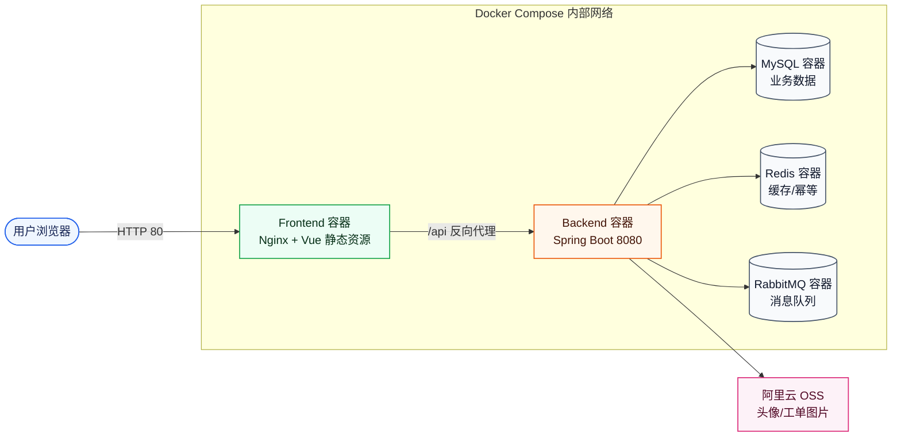
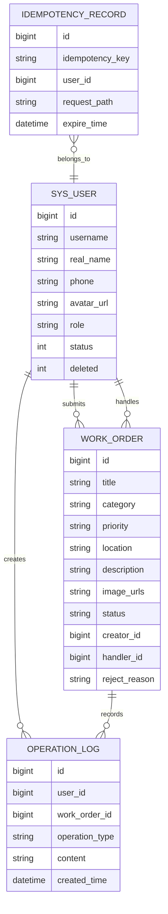

# 校园工单管理系统需求分析

| 项目 | 内容 |
|---|---|
| 学校 | 安徽师范大学 |
| 指导老师 | 杜同春 |
| 专业 | 计算机技术 |
| 学号 | 2521022918 |
| 姓名 | 胡雪飞 |
| 日期 | 2026-06-26 |

## 1. 业务背景与目标

### 1.1 业务背景

高校校园日常运行过程中，宿舍、教学楼、实验楼、图书馆等场景会频繁出现网络故障、电器损坏、水电维修、家具设施损坏、门锁故障等问题。传统报修方式通常依赖电话、微信群、人工登记或线下反馈，容易出现以下问题：

- 报修信息不完整，现场图片、地点、问题描述不统一；
- 管理人员难以及时掌握全部报修事项、处理进度和优先级；
- 工单分配依赖人工沟通，维修人员接单和处理状态不透明；
- 学生无法实时查看工单进度；
- 历史工单、维修效率、问题类型分布难以统计；
- 用户权限、账号状态、维修人员变更等场景缺少系统化约束。

因此，本项目选择“校园维修工单”作为互联网业务场景，设计并实现一个面向学生、维修人员、管理员、超级管理员的校园工单管理系统。系统通过线上提交、审核、分配、接单、处理、拒绝、取消、统计分析等流程，提高校园维修事务的处理效率和可追踪性。

### 1.2 建设目标

本系统的建设目标包括：

1. 建立统一的校园报修入口，学生可在线提交工单并上传现场图片；
2. 建立清晰的工单状态流转机制，覆盖待审核、待分配、待处理、处理中、已完成、已驳回、被拒绝、已取消等状态；
3. 支持管理员审核、分配、查询、统计和管理工单；
4. 支持维修人员接单、拒单、处理和完成工单；
5. 支持学生查看个人工单进度、查看拒绝原因和取消工单；
6. 支持用户注册、登录、角色权限控制、用户管理和个人信息维护；
7. 引入并发与幂等控制，避免重复提交、重复接单、非法状态流转；
8. 支持 Redis 缓存、RabbitMQ 消息队列、Docker 部署、CI/CD 流程和性能测试；
9. 形成具有企业级工程质量的后端系统与完整项目材料。

### 1.3 业务边界与核心规则

校园工单系统不是简单的信息登记页面，而是围绕“报修问题从提出到解决”的完整业务闭环进行设计。系统需要同时解决报修入口统一、责任人明确、状态可追踪、异常可回退、数据可统计等问题。

#### 1.3.1 业务边界

| 边界类型 | 范围说明 |
|---|---|
| 业务范围内 | 学生报修、工单图片上传、管理员审核、工单分配、维修人员接单/拒单/完成、学生查看进度、用户管理、统计分析 |
| 业务范围外 | 线下维修材料采购、费用结算、复杂审批流、跨校区库存调度、短信或微信通知 |
| 核心管理对象 | 用户、角色、工单、图片、状态、处理人、拒绝原因、操作记录 |
| 核心质量要求 | 状态清晰、权限明确、数据一致、页面易用、部署可复现 |

#### 1.3.2 核心业务规则

| 规则编号 | 规则内容 | 设计原因 |
|---|---|---|
| BR-01 | 学生提交工单后默认进入待审核 | 避免无效、重复或描述不清的工单直接进入维修流程 |
| BR-02 | 管理员审核通过后，工单进入待分配 | 体现管理端对维修资源的统一调度 |
| BR-03 | 待分配工单绑定维修人员后，展示为待处理 | 区分“未派人”和“已派人但未接单”两个业务阶段 |
| BR-04 | 维修人员接单后，工单进入处理中 | 表示维修人员已经确认承担该任务 |
| BR-05 | 维修人员可以拒绝接单，但必须填写拒绝原因 | 便于管理员重新分配，也便于学生了解工单停滞原因 |
| BR-06 | 学生只能取消待审核、待分配、待处理或被拒绝等未实际处理完成的工单 | 避免处理中或已完成工单被随意取消造成数据混乱 |
| BR-07 | 管理员禁用、删除维修人员或将维修人员改成学生时，其待处理/处理中工单需要回到待分配 | 防止任务继续绑定到不可处理人员 |
| BR-08 | 已完成工单保留历史处理人和处理结果 | 保证维修记录可追溯，不因人员变化破坏历史数据 |
| BR-09 | 用户删除采用逻辑删除 | 避免历史工单、操作记录和统计数据断链 |
| BR-10 | 工单图片上传后，如果用户在提交前删除图片，则该图片不写入最终工单记录 | 保证数据库中保存的是用户最终确认的现场图片 |

#### 1.3.3 业务价值分析

| 参与方 | 业务痛点 | 系统价值 |
|---|---|---|
| 学生 | 报修渠道分散、进度不透明、无法补充现场图片 | 提供统一入口、图片上传、进度查询和异常原因查看 |
| 维修人员 | 任务来源不统一、接单责任不清、历史任务难追踪 | 提供待处理任务列表、接单/拒单/完成闭环和历史记录 |
| 管理员 | 工单分配依赖人工沟通、状态统计困难、人员变化影响任务 | 提供审核分配、状态查询、用户管理和任务回退规则 |
| 超级管理员 | 管理员账号和系统基础数据缺少统一管理 | 提供更高权限的用户管理和系统维护能力 |
| 学校管理者 | 无法了解维修类型分布、处理效率和新增趋势 | 通过仪表盘统计支撑后续管理决策 |

## 2. 用户角色与用例

### 2.1 用户角色

| 角色 | 说明 | 主要权限 |
|---|---|---|
| 游客 | 未登录用户 | 访问登录页、注册账号 |
| 学生 | 工单提交者 | 新建工单、上传图片、查看个人工单、取消工单、查看拒绝原因、维护个人信息 |
| 维修人员 | 工单处理者 | 查看分配给自己的任务、接单、拒绝接单、处理工单、完成工单 |
| 管理员 | 工单调度与用户管理者 | 审核工单、分配工单、查看统计、管理普通用户、重置密码、禁用或删除用户 |
| 超级管理员 | 系统最高权限角色 | 拥有管理员能力，并可管理管理员角色用户 |

### 2.2 主要用例

#### 2.2.1 学生用例

| 用例编号 | 用例名称 | 说明 |
|---|---|---|
| S-01 | 注册账号 | 学生通过注册页面创建账号 |
| S-02 | 登录系统 | 使用账号密码登录系统 |
| S-03 | 新建工单 | 填写标题、类别、地点、优先级、问题描述并上传现场图片 |
| S-04 | 查看我的工单 | 查看个人提交的工单列表和状态 |
| S-05 | 查看工单详情 | 查看工单内容、图片、处理状态、拒绝原因等 |
| S-06 | 取消工单 | 对待审核、待分配、待处理或被拒绝等允许取消的工单执行取消 |
| S-07 | 修改个人信息 | 修改用户名、真实姓名、手机号、头像 |
| S-08 | 修改密码 | 输入原密码、新密码和确认密码完成密码修改 |

#### 2.2.2 维修人员用例

| 用例编号 | 用例名称 | 说明 |
|---|---|---|
| W-01 | 登录系统 | 维修人员登录后进入任务页面 |
| W-02 | 查看待处理任务 | 查看管理员分配给自己的待接单工单 |
| W-03 | 接单 | 对待处理工单执行接单，工单进入处理中 |
| W-04 | 拒绝接单 | 填写拒绝原因，工单进入被拒绝状态 |
| W-05 | 完成工单 | 填写处理结果，工单进入已完成 |
| W-06 | 查看历史任务 | 查看已完成或已拒绝的工单记录 |
| W-07 | 查看我的工单 | 维修人员也可查看自己作为报修人提交的工单 |
| W-08 | 维护个人信息 | 修改资料、密码和头像 |

#### 2.2.3 管理员用例

| 用例编号 | 用例名称 | 说明 |
|---|---|---|
| A-01 | 审核工单 | 对学生提交的待审核工单进行通过或驳回 |
| A-02 | 分配工单 | 将待分配工单分配给可用维修人员 |
| A-03 | 查看全部工单 | 按状态、类别、优先级、时间、关键字等条件查询工单 |
| A-04 | 查看拒绝详情 | 查看维修人员拒绝接单的原因 |
| A-05 | 管理用户 | 新增、查看、修改、删除、启用、禁用用户 |
| A-06 | 重置密码 | 将指定用户密码重置为默认密码 |
| A-07 | 批量操作 | 批量删除、批量重置密码、批量通过审核等 |
| A-08 | 查看仪表盘 | 查看今日新增、状态分布、类别分布、优先级分布和趋势统计 |
| A-09 | 维护个人信息 | 修改管理员自己的资料、密码和头像 |

#### 2.2.4 超级管理员用例

| 用例编号 | 用例名称 | 说明 |
|---|---|---|
| SA-01 | 管理管理员 | 新增、修改、删除普通管理员 |
| SA-02 | 管理全部用户 | 拥有比普通管理员更高的用户管理范围 |
| SA-03 | 系统级维护 | 参与系统初始化、权限检查和数据维护 |

### 2.3 角色用例图

为避免单张用例图过于拥挤，系统按角色职责拆分为三组：学生与游客、维修人员、管理员与超级管理员。

说明：以下图采用较大的节点间距和横向间距，导出为 Word 或 PDF 时建议保持页面横向或按原比例插入，避免图片被页面宽度压缩后显得过窄。

#### 2.3.1 学生与游客用例图

#### 2.3.2 维修人员用例图

#### 2.3.3 管理员与超级管理员用例图

### 2.4 用例完整性与异常场景

为保证用例不是只覆盖“正常点击流程”，本系统对核心用例同时考虑前置条件、成功结果、异常分支和边界条件。

#### 2.4.1 核心用例闭环

| 核心用例 | 前置条件 | 正常结果 | 异常或边界处理 |
|---|---|---|---|
| 学生注册 | 游客未登录 | 创建学生账号并可登录 | 用户名重复、手机号格式错误、密码不符合规则时拒绝注册 |
| 学生新建工单 | 学生已登录 | 生成待审核工单 | 必填项为空、图片类型错误、重复提交时提示并阻止 |
| 管理员审核工单 | 工单处于待审核 | 审核通过进入待分配，驳回进入已驳回 | 非待审核工单不能重复审核 |
| 管理员分配工单 | 工单处于待分配 | 绑定维修人员，展示为待处理 | 禁用用户、非维修人员、已删除维修人员不出现在分配列表 |
| 维修人员接单 | 工单已分配给当前维修人员 | 工单进入处理中 | 已被取消、已被重新分配、已完成的工单不能接单 |
| 维修人员拒单 | 工单已分配给当前维修人员 | 工单进入被拒绝并记录原因 | 拒绝原因为空时不允许提交 |
| 维修人员完成工单 | 工单处于处理中 | 工单进入已完成并记录处理结果 | 非处理中状态不能完成 |
| 学生取消工单 | 工单尚未完成且符合可取消状态 | 工单进入已取消 | 已完成、处理中或非本人创建的工单不能取消 |
| 管理员删除用户 | 管理员具备权限 | 用户逻辑删除 | 如果删除维修人员，需要先处理其未完成工单绑定 |
| 用户修改个人信息 | 用户已登录 | 保存用户名、真实姓名、手机号或头像 | 用户名重复、手机号格式错误、头像上传失败时提示 |

#### 2.4.2 角色权限矩阵

| 功能 | 游客 | 学生 | 维修人员 | 管理员 | 超级管理员 |
|---|---|---|---|---|---|
| 注册/登录 | 支持 | 支持 | 支持 | 支持 | 支持 |
| 新建工单 | 不支持 | 支持 | 不支持 | 不支持 | 不支持 |
| 查看我的工单 | 不支持 | 支持 | 支持 | 不支持 | 不支持 |
| 接单/拒单/完成 | 不支持 | 不支持 | 支持 | 不支持 | 不支持 |
| 审核/分配工单 | 不支持 | 不支持 | 不支持 | 支持 | 支持 |
| 用户管理 | 不支持 | 不支持 | 不支持 | 支持普通用户 | 支持全部用户和管理员 |
| 仪表盘统计 | 不支持 | 支持个人相关统计 | 支持任务相关统计 | 支持全局统计 | 支持全局统计 |
| 个人信息维护 | 不支持 | 支持 | 支持 | 支持 | 支持 |

#### 2.4.3 关键边界条件

| 边界条件 | 系统处理 |
|---|---|
| 同一学生短时间重复点击提交 | 通过幂等控制避免生成重复工单 |
| 管理员正在分配时，工单被学生取消 | 后端以当前状态为准，状态不匹配则拒绝分配 |
| 维修人员接单前被禁用或删除 | 工单解除维修人员绑定并回到待分配 |
| 维修人员拒单后学生希望撤销报修 | 学生可对被拒绝工单执行取消 |
| 上传图片后又删除图片 | 删除后的图片不写入工单图片字段 |
| 用户角色发生变化 | 根据新角色刷新菜单权限，同时处理原角色遗留业务 |
| 小屏幕查看表格或图片 | 表格、图片列表和图表区域支持横向滚动 |
| OSS、Redis、RabbitMQ 等外部依赖异常 | 页面给出失败提示，后端保留可定位的错误信息 |

## 3. 业务流程图

### 3.0 系统总体架构图

### 3.1 工单主流程

### 3.2 工单状态流转

状态口径说明：系统代码中未单独设置 `PENDING_ASSIGN` 枚举，待分配与待处理均基于 `PENDING_PROCESS` 状态展示。区别在于是否已经绑定维修人员：`handler_id` 为空时展示为“待分配”，`handler_id` 不为空时展示为“待处理”。这样既减少后端状态枚举数量，也能在前端清晰区分管理员分配前后两个业务阶段。

### 3.3 用户管理业务流程

### 3.4 部署架构图

### 3.5 核心数据关系图

## 4. 功能需求列表

### 4.1 用户与权限模块

| 编号 | 功能 | 优先级 | 说明 |
|---|---|---|---|
| F-01 | 用户注册 | 高 | 支持学生注册账号，注册时选择身份 |
| F-02 | 用户登录 | 高 | 使用用户名和密码登录，后端返回 JWT |
| F-03 | 角色权限控制 | 高 | 根据 STUDENT、WORKER、ADMIN、SUPER_ADMIN 控制接口和页面权限 |
| F-04 | 记住账号密码 | 中 | 登录页勾选后，下次打开页面自动填充账号密码 |
| F-05 | 个人信息维护 | 高 | 修改用户名、真实姓名、手机号、头像 |
| F-06 | 修改密码 | 高 | 输入原密码、新密码、确认密码完成修改 |
| F-07 | 用户状态控制 | 高 | 禁用用户后禁止其正常参与业务操作 |

### 4.2 工单提交模块

| 编号 | 功能 | 优先级 | 说明 |
|---|---|---|---|
| F-08 | 新建工单 | 高 | 学生填写标题、地点、类别、优先级、问题描述 |
| F-09 | 图片上传 | 高 | 支持上传现场图片至 OSS |
| F-10 | 图片删除 | 高 | 上传后删除的图片不应写入最终工单 |
| F-11 | 参数校验 | 高 | 标题、地点、类别、描述、手机号等字段需符合规则 |
| F-12 | 幂等提交 | 高 | 避免网络重复点击造成重复工单 |

### 4.3 工单管理模块

| 编号 | 功能 | 优先级 | 说明 |
|---|---|---|---|
| F-13 | 工单审核 | 高 | 管理员审核待审核工单 |
| F-14 | 工单分配 | 高 | 管理员将工单分配给维修人员 |
| F-15 | 工单查询 | 高 | 支持按状态、类别、优先级、时间、关键字查询 |
| F-16 | 工单详情 | 高 | 展示标题、地点、描述、图片、处理状态、处理人等信息 |
| F-17 | 批量通过 | 中 | 管理员可批量通过待审核工单 |
| F-18 | 拒绝详情查看 | 高 | 管理员可查看维修人员拒绝原因 |

### 4.4 维修人员任务模块

| 编号 | 功能 | 优先级 | 说明 |
|---|---|---|---|
| F-19 | 查看我的任务 | 高 | 维修人员查看分配给自己的工单 |
| F-20 | 接单 | 高 | 待处理工单接单后进入处理中 |
| F-21 | 拒绝接单 | 高 | 拒绝时必须填写理由 |
| F-22 | 完成工单 | 高 | 填写处理结果并完成工单 |
| F-23 | 查看历史任务 | 中 | 查看已完成或已拒绝任务 |

### 4.5 学生我的工单模块

| 编号 | 功能 | 优先级 | 说明 |
|---|---|---|---|
| F-24 | 查看我的工单 | 高 | 学生查看本人提交的全部工单 |
| F-25 | 查看工单图片 | 高 | 支持横向滑动查看现场图片 |
| F-26 | 取消工单 | 中 | 对允许取消的状态执行取消 |
| F-27 | 查看拒绝原因 | 高 | 工单被拒绝后学生可查看维修人员填写的理由 |

### 4.6 管理员用户管理模块

| 编号 | 功能 | 优先级 | 说明 |
|---|---|---|---|
| F-28 | 新增用户 | 高 | 管理员新增学生或维修人员，超级管理员可新增管理员 |
| F-29 | 修改用户 | 高 | 修改用户名、真实姓名、手机号、角色、状态 |
| F-30 | 查看用户 | 中 | 查看用户详情和头像 |
| F-31 | 重置密码 | 高 | 将用户密码重置为 123456 |
| F-32 | 删除用户 | 高 | 使用逻辑删除，保留历史关联 |
| F-33 | 批量删除 | 中 | 支持批量逻辑删除用户 |
| F-34 | 批量重置密码 | 中 | 支持批量重置密码 |
| F-35 | 维修人员变更处理 | 高 | 禁用、删除、角色变更时，其未完成工单回到待分配 |

### 4.7 仪表盘与统计模块

| 编号 | 功能 | 优先级 | 说明 |
|---|---|---|---|
| F-36 | 今日新增统计 | 高 | 显示当天新增工单数量 |
| F-37 | 状态分布统计 | 中 | 展示各状态工单数量 |
| F-38 | 类别分布统计 | 中 | 展示不同维修类别数量 |
| F-39 | 优先级分布统计 | 中 | 展示低、中、高优先级分布 |
| F-40 | 趋势统计 | 中 | 展示近期工单变化趋势 |

### 4.8 文件与 OSS 模块

| 编号 | 功能 | 优先级 | 说明 |
|---|---|---|---|
| F-41 | 头像上传 | 高 | 用户可上传头像 |
| F-42 | 工单图片上传 | 高 | 学生提交工单时上传现场图 |
| F-43 | 图片预览 | 高 | 表格、详情页、个人信息页均支持预览 |
| F-44 | OSS 配置 | 高 | 通过环境变量配置 OSS Endpoint、Bucket、AccessKey 和访问前缀 |

### 4.9 工程化模块

| 编号 | 功能 | 优先级 | 说明 |
|---|---|---|---|
| F-45 | Docker 部署 | 高 | 使用 Docker Compose 启动前端、后端、MySQL、Redis、RabbitMQ |
| F-46 | CI/CD | 高 | GitHub Actions 支持构建、测试、Docker 校验 |
| F-47 | 性能测试 | 中 | 使用 k6 测试工单接口吞吐和响应时间 |
| F-48 | AI 使用记录 | 中 | 记录 AI 提示词、协作过程和 Skill 封装 |

## 5. 非功能需求

### 5.1 性能需求

| 指标 | 目标 |
|---|---|
| 普通列表查询响应时间 | 目标 P95 小于 500ms |
| 工单详情查询响应时间 | 目标 P95 小于 300ms |
| 图片上传响应时间 | 受 OSS 网络影响，目标 3 秒内完成常规图片上传 |
| 并发请求能力 | 支持压测场景下约 1000 次/分钟请求 |
| 首页统计加载 | 在数据量适中时 1 秒内返回 |

性能优化措施：

- 工单、用户列表采用分页查询；
- 对常用查询字段建立索引；
- 使用 Redis 缓存热点统计或临时数据；
- 使用 k6 脚本对关键接口进行压测；
- 前端图片横向滚动与懒加载思路，避免一次性撑开页面。

### 5.2 并发与幂等需求

系统需要处理以下并发问题：

| 场景 | 风险 | 处理方式 |
|---|---|---|
| 学生重复点击提交 | 生成重复工单 | 使用幂等 Token 或 Idempotency-Key |
| 多管理员同时分配同一工单 | 处理人覆盖或状态错乱 | 状态校验、乐观锁或版本号控制 |
| 维修人员重复接单 | 工单状态重复变更 | 接单前校验当前状态必须为待处理 |
| 维修人员接单与管理员重新分配并发 | 数据不一致 | 状态机校验和事务控制 |
| 批量操作并发 | 部分成功、部分失败 | 批量处理返回明确结果，失败项记录原因 |

幂等设计要求：

- 创建工单接口应支持幂等标识；
- 关键状态变更接口需要校验当前状态；
- 重复请求不能产生重复业务结果；
- 幂等记录可存储在数据库或 Redis 中，并设置过期策略。

### 5.3 数据量估计

以中等规模学院或校园试点使用为参考：

| 数据对象 | 估计规模 |
|---|---|
| 学生用户 | 1000 - 10000 |
| 维修人员 | 20 - 200 |
| 管理员 | 2 - 20 |
| 日均工单 | 50 - 500 |
| 年工单量 | 2 万 - 20 万 |
| 单个工单图片 | 0 - 6 张 |
| 操作日志 | 随工单状态变更增长，年规模可达数十万条 |

数据库设计要求：

- 工单表需要对 `status`、`category`、`priority`、`created_time`、`handler_id` 等字段建立索引；
- 图片 URL 可使用 JSON 字符串或关联表存储；
- 用户表应支持逻辑删除；
- 操作日志表应记录关键业务行为；
- 历史数据可按时间归档。

### 5.4 安全需求

| 安全项 | 要求 |
|---|---|
| 认证方式 | 使用 JWT 认证 |
| 权限控制 | 后端接口按角色限制访问 |
| 密码存储 | 密码应加密存储，不保存明文 |
| 敏感配置 | OSS 密钥、数据库密码、JWT 密钥使用环境变量 |
| 文件上传 | 限制文件类型和大小 |
| SQL 安全 | 使用 ORM 或参数化查询，避免 SQL 注入 |
| 逻辑删除 | 删除用户不物理删除，避免历史数据断链 |

### 5.5 可用性与可维护性需求

- 系统应支持 Docker Compose 快速部署；
- 前后端应分层清晰，便于维护；
- 业务状态流转应集中校验，避免散落在多个页面；
- 重要操作应记录日志；
- 初始化 SQL 应支持一键初始化演示数据；
- README、部署说明、CI/CD 配置、AI 使用记录等文档应完整归档。

### 5.6 易用性需求

- 页面风格结合安徽师范大学元素，符合校园系统定位；
- 表格支持刷新、查询、分页和批量操作；
- 标题、地点等长文本应省略展示，鼠标悬停可查看完整内容；
- 图片支持预览、放大和遮罩关闭；
- 小屏幕下表格和图表支持横向滚动，避免布局错乱。

## 6. 风险识别与应对

风险识别从业务流程、数据一致性、权限安全、外部依赖、工程部署和用户体验六个维度展开。对于高影响风险，系统在需求阶段就明确对应约束，避免实现阶段只依赖前端页面控制。

| 风险编号 | 风险类别 | 风险描述 | 可能影响 | 可能性 | 影响程度 | 应对措施 |
|---|---|---|---|---|---|---|
| R-01 | 业务流程 | 工单状态流转复杂，容易出现非法状态 | 工单无法继续处理或状态混乱 | 中 | 高 | 使用状态机思想，所有状态变更前校验当前状态 |
| R-02 | 业务流程 | 待分配与待处理都基于 `PENDING_PROCESS`，口径容易混淆 | 管理端、学生端、维修端显示不一致 | 中 | 中 | 明确以 `handler_id` 是否为空区分展示状态 |
| R-03 | 业务流程 | 维修人员拒单后无人重新分配 | 工单长期停滞，学生体验差 | 中 | 高 | 被拒绝工单进入独立状态，管理员可查看拒绝原因并重新分配 |
| R-04 | 业务流程 | 学生取消工单范围过宽或过窄 | 影响维修流程或影响学生撤销权 | 中 | 中 | 只允许待审核、待分配、待处理、被拒绝等未完成状态取消 |
| R-05 | 数据一致性 | 学生重复点击提交 | 生成重复工单，造成维修重复派单 | 高 | 高 | 引入幂等 Token 或 Idempotency-Key |
| R-06 | 数据一致性 | 多管理员同时分配同一工单 | 处理人覆盖或状态错乱 | 中 | 高 | 使用事务、状态校验、乐观锁或版本号控制 |
| R-07 | 数据一致性 | 维修人员重复接单或接单时状态已变化 | 工单状态重复变更 | 中 | 高 | 接单前校验当前状态必须为待处理且处理人为当前用户 |
| R-08 | 数据一致性 | 上传图片后删除，但最终仍写入数据库 | 工单展示用户已删除的图片 | 中 | 中 | 提交时以后端接收的最终图片 URL 列表为准 |
| R-09 | 用户管理 | 维修人员被禁用、删除或改为学生后仍绑定任务 | 工单无人处理，任务无法闭环 | 中 | 高 | 自动解除维修人员绑定，待处理/处理中工单回到待分配 |
| R-10 | 权限安全 | 学生访问管理接口或维修人员访问他人任务 | 越权操作、数据泄露 | 中 | 高 | 前端路由控制 + 后端接口角色校验，以后端校验为准 |
| R-11 | 权限安全 | 敏感信息误提交 GitHub | OSS、数据库、JWT 等密钥泄露 | 中 | 高 | `.env` 加入忽略，仅提交 `.env.example`，配置走环境变量 |
| R-12 | 文件服务 | OSS 配置错误、Bucket 权限异常或 URL 前缀错误 | 头像、工单图片无法上传或查看 | 中 | 中 | 使用环境变量配置，检查 Bucket 权限、Endpoint 和 URL 前缀 |
| R-13 | 初始化数据 | 初始化 SQL 中文乱码 | 演示数据异常，影响答辩展示 | 中 | 中 | SQL 首行设置 `SET NAMES utf8mb4;`，数据库使用 utf8mb4 |
| R-14 | 性能 | 数据量增长后列表查询变慢 | 管理端和我的工单页面加载变慢 | 中 | 中 | 分页查询、索引优化、缓存热点统计数据 |
| R-15 | 性能 | 首页统计实时聚合成本较高 | 仪表盘响应慢 | 中 | 中 | 缓存统计结果，必要时使用异步刷新 |
| R-16 | 可用性 | 前端页面小屏显示错乱 | 用户体验下降，表格内容不可读 | 高 | 中 | 表格、图表、图片区域支持横向滚动和自适应布局 |
| R-17 | 工程部署 | CI/CD 配置不完整 | 无法证明工程化能力，交付不稳定 | 中 | 中 | 保留 GitHub Actions、Dockerfile、部署脚本和说明文档 |
| R-18 | 外部依赖 | Redis 或 RabbitMQ 未启动 | 幂等、缓存或消息功能受影响 | 中 | 中 | Docker Compose 统一编排，启动前检查依赖服务 |
| R-19 | 可维护性 | 业务校验散落在前端页面 | 后续修改容易遗漏，后端接口不安全 | 中 | 高 | 核心状态校验放在后端 Service 层，前端只做交互辅助 |
| R-20 | 数据追溯 | 物理删除用户导致历史工单断链 | 历史记录、统计和审计不可追溯 | 低 | 高 | 用户删除采用逻辑删除，历史工单保留关联信息 |

风险优先级判断原则：优先处理“影响业务闭环、影响数据一致性、影响权限安全”的风险；其次处理性能、体验和部署类风险。对于课程验收和项目展示，重点保证核心流程可演示、状态流转可解释、初始化数据可恢复、部署脚本可复现。

## 7. 验收标准

系统完成后应满足以下验收标准：

1. 学生可以注册、登录、新建工单、上传图片并查看个人工单；
2. 管理员可以审核、分配、查询和管理工单；
3. 维修人员可以接单、拒绝接单、完成工单；
4. 工单状态流转符合业务规则，不允许非法跳转；
5. 用户管理支持新增、修改、删除、禁用、重置密码和批量操作；
6. 删除、禁用或变更维修人员角色时，未完成工单能够正确回退；
7. 首页仪表盘能展示真实业务统计数据；
8. 系统支持 Docker Compose 一键部署；
9. 项目包含 CI/CD 配置、构建脚本、测试脚本和部署说明；
10. 项目包含 AI 使用记录和 Skill 封装复用材料；
11. 初始化 SQL 可正常导入，中文不乱码；
12. 敏感配置不直接提交到公开仓库。

## 8. 总结

校园工单管理系统围绕高校维修报修业务，建立了从学生提交、管理员审核分配、维修人员处理到学生查看结果的完整闭环。系统不仅实现了用户与权限、核心业务、状态机、并发幂等、文件上传、统计分析等业务能力，还补充了 Docker 部署、CI/CD、性能测试、AI 使用记录等工程化材料。

从需求角度看，本项目能够满足互联网业务系统对功能完整性、状态清晰性、数据一致性、可部署性和可维护性的基本要求，具备较好的课程验收和工程展示价值。
