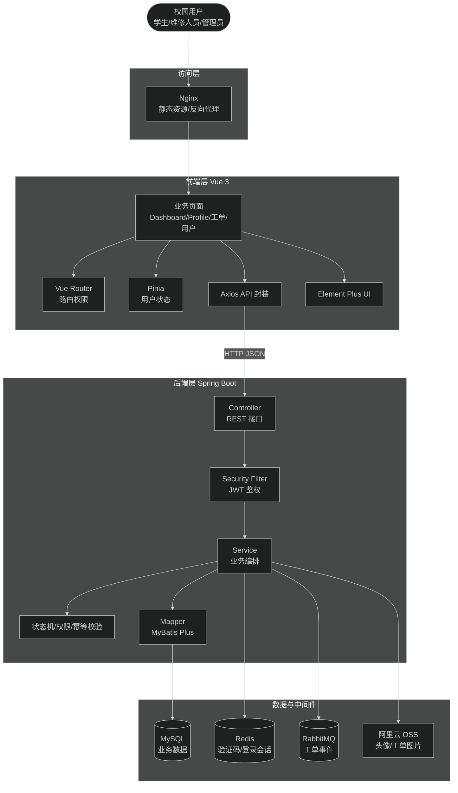
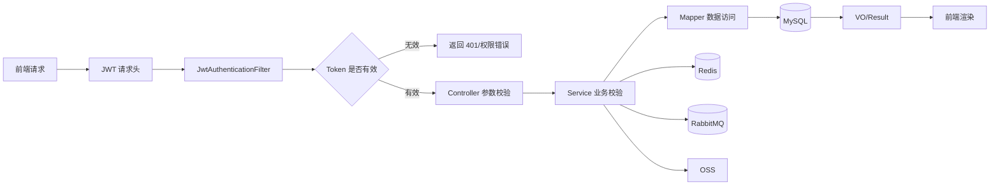
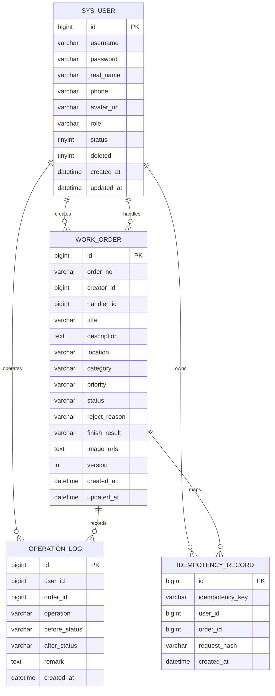
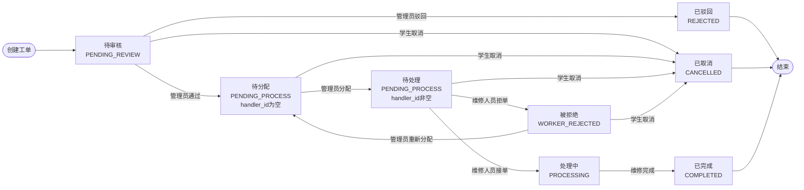
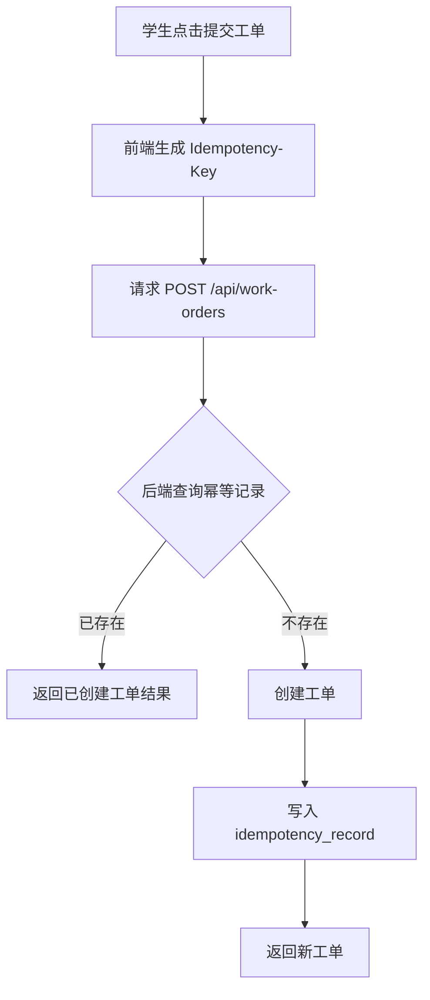
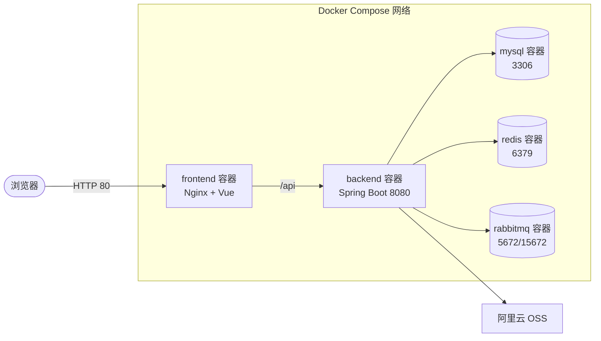
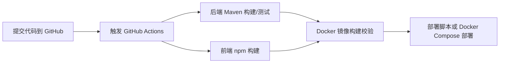

# 校园工单管理系统系统设计文档

| 项目 | 内容 |
|---|---|
| 学校 | 安徽师范大学 |
| 指导老师 | 杜同春 |
| 专业 | 计算机技术 |
| 学号 | 2521022918 |
| 姓名 | 胡雪飞 |
| 日期 | 2026-06-26 |

## 1. 文档说明

### 1.1 文档目的

本文档用于说明校园工单管理系统的整体设计方案，包括系统架构、技术选型、模块划分、数据库设计、接口设计、状态机设计、并发与幂等方案、缓存与消息队列设计以及部署架构。文档目标是保证系统设计与实际代码实现一致，便于课程验收、项目维护和后续扩展。

### 1.2 项目定位

校园工单管理系统面向高校报修场景，提供学生报修、管理员审核分配、维修人员接单处理、学生查看进度、用户管理和统计分析等能力。系统采用前后端分离架构，后端以 Spring Boot 为核心，前端以 Vue 3 为核心，数据层使用 MySQL，缓存和会话管理使用 Redis，异步事件扩展使用 RabbitMQ，图片文件存储使用阿里云 OSS。

### 1.3 设计目标

| 目标 | 说明 |
|---|---|
| 架构清晰 | 前端、后端、数据库、中间件和对象存储职责明确 |
| 权限可靠 | 基于 JWT、Spring Security 和角色权限控制接口访问 |
| 流程可控 | 工单状态流转由后端统一校验，避免非法跳转 |
| 数据一致 | 使用事务、乐观锁、幂等记录和状态校验降低并发风险 |
| 易部署 | 支持 Docker Compose 一键部署前端、后端、MySQL、Redis、RabbitMQ |
| 可扩展 | 通过消息队列、缓存、分层结构保留后续扩展空间 |

## 2. 系统总体架构

### 2.1 总体架构图



### 2.2 架构分层说明

| 层级 | 主要职责 | 关键技术 |
|---|---|---|
| 表现层 | 页面展示、表单校验、路由跳转、图片预览、图表展示 | Vue 3、Element Plus、Vue Router、Pinia |
| 接口层 | 接收 HTTP 请求、参数校验、统一返回结果 | Spring Web、Validation |
| 安全层 | 登录认证、JWT 校验、角色权限控制、退出登录 | Spring Security、JWT、Redis |
| 业务层 | 工单状态流转、用户管理、图片处理、统计分析、幂等控制 | Spring Boot Service、事务、业务异常 |
| 数据访问层 | 对 MySQL 表进行增删改查和分页查询 | MyBatis Plus |
| 数据存储层 | 保存用户、工单、日志、幂等记录等结构化数据 | MySQL |
| 缓存/会话层 | 保存验证码、登录会话、可扩展热点统计缓存 | Redis |
| 消息层 | 发布和消费工单变更事件 | RabbitMQ |
| 文件层 | 保存头像和工单现场图片 | 阿里云 OSS |
| 部署层 | 容器化运行和服务编排 | Docker、Docker Compose、Nginx |

## 3. 技术选型与理由

### 3.1 后端技术选型

| 技术 | 用途 | 选择理由 |
|---|---|---|
| Java 17 | 后端开发语言 | 生态成熟，适合企业级 Web 系统 |
| Spring Boot 3.3.5 | 后端基础框架 | 快速构建 REST 服务，和安全、缓存、消息组件集成方便 |
| Spring Security | 认证与授权 | 支持过滤器链、角色权限控制，适合后端接口保护 |
| JWT | 登录态令牌 | 前后端分离场景下易于携带和校验 |
| MyBatis Plus | ORM/数据访问 | 简化 CRUD、分页、乐观锁、逻辑删除等实现 |
| MySQL 8 | 关系型数据库 | 适合用户、工单、日志等强结构化数据 |
| Redis | 缓存与会话 | 支持验证码过期、登录会话校验、主动退出 |
| RabbitMQ | 消息队列 | 用于工单状态变更事件，便于后续扩展通知、日志、异步任务 |
| Aliyun OSS | 文件存储 | 工单图片和头像不直接存入数据库，降低数据库压力 |
| Lombok | 简化实体代码 | 减少 getter/setter 等样板代码 |

### 3.2 前端技术选型

| 技术 | 用途 | 选择理由 |
|---|---|---|
| Vue 3 | 前端框架 | 组件化开发，适合管理系统页面 |
| Vite | 构建工具 | 启动快，开发体验好 |
| Vue Router | 路由管理 | 支持页面跳转和路由级权限控制 |
| Pinia | 状态管理 | 管理当前登录用户、Token、角色等状态 |
| Axios | HTTP 请求 | 统一封装请求头、错误处理和接口调用 |
| Element Plus | UI 组件库 | 表单、表格、弹窗、上传、分页等管理系统组件完善 |

### 3.3 部署与工程化技术选型

| 技术 | 用途 | 选择理由 |
|---|---|---|
| Dockerfile | 构建前后端镜像 | 保证运行环境一致 |
| Docker Compose | 服务编排 | 一次性启动前端、后端、MySQL、Redis、RabbitMQ |
| Nginx | 前端静态资源托管和反向代理 | 适合部署 Vue 构建产物 |
| GitHub Actions | CI/CD 自动化 | 支持代码提交后自动构建、测试、Docker 校验 |
| k6 | 性能测试 | 可验证接口吞吐和响应时间 |

## 4. 后端模块设计

### 4.1 后端包结构

```text
com.example.workorder
├── common            统一返回结构
├── config            MyBatis、Redis、RabbitMQ、OSS、安全等配置
├── controller        REST 接口控制器
├── dto               请求参数对象
├── entity            数据库实体
├── enums             角色、工单状态、优先级枚举
├── exception         业务异常与全局异常处理
├── mapper            MyBatis Plus Mapper
├── mq                工单事件发布与消费
├── security          JWT、登录会话、认证过滤器
├── service           业务接口
├── service.impl      业务实现
└── vo                返回视图对象
```

### 4.2 核心模块划分

| 模块 | 主要文件 | 设计说明 |
|---|---|---|
| 认证模块 | `AuthController`、`AuthService`、`JwtUtil`、`JwtAuthenticationFilter`、`AuthSessionService` | 提供注册、登录、退出、当前用户信息获取；JWT 负责身份令牌，Redis 负责服务端会话有效性 |
| 验证码模块 | `CaptchaService`、`CaptchaServiceImpl` | 使用 Redis 保存验证码并设置过期时间，校验时通过 Lua 脚本实现读取后删除 |
| 用户管理模块 | `UserController`、`SysUser`、`SysUserMapper`、`UserRole` | 管理用户新增、修改、状态、角色、重置密码、逻辑删除和批量操作 |
| 工单模块 | `WorkOrderController`、`WorkOrderServiceImpl`、`WorkOrder`、`WorkOrderStatus` | 处理工单创建、查询、审核、分配、接单、拒单、完成、取消、统计 |
| 文件模块 | `FileController`、`OssService`、`OssProperties` | 支持头像和工单图片上传到 OSS |
| 消息队列模块 | `WorkOrderEventPublisher`、`WorkOrderEventConsumer`、`RabbitMqConfig` | 发布和消费工单变更事件 |
| 异常处理模块 | `BusinessException`、`GlobalExceptionHandler` | 统一业务错误和系统错误响应 |
| 幂等模块 | `IdempotencyRecord`、`IdempotencyRecordMapper` | 创建工单时记录幂等 Key，避免重复提交 |

### 4.3 后端请求处理流程



## 5. 前端模块设计

### 5.1 前端目录结构

```text
src
├── api              后端接口封装
├── assets           静态资源
├── router           路由与权限控制
├── stores           Pinia 状态
├── views            页面组件
└── main.js          前端入口
```

### 5.2 页面与角色映射

| 页面 | 路由 | 访问角色 | 说明 |
|---|---|---|---|
| 登录页 | `/login` | 游客 | 用户登录 |
| 注册页 | `/register` | 游客 | 用户注册，可选择身份 |
| 首页仪表盘 | `/dashboard` | 登录用户 | 展示统计数据和图表 |
| 用户信息 | `/profile` | 登录用户 | 修改个人信息、头像、密码 |
| 新建工单 | `/student/create-order` | 学生 | 提交报修工单和现场图片 |
| 我的工单 | `/student/my-orders` | 学生、维修人员 | 查看本人创建的工单 |
| 工单管理 | `/admin/orders` | 管理员、超级管理员 | 审核、分配、查看工单 |
| 用户管理 | `/admin/users` | 管理员、超级管理员 | 新增、修改、删除、重置用户 |
| 我的任务 | `/worker/tasks` | 维修人员 | 接单、拒单、完成任务 |

### 5.3 前端权限设计

前端通过路由 `meta.roles` 控制页面访问范围。用户登录成功后，用户信息和 Token 保存到 Pinia/localStorage。请求拦截器自动在请求头中添加 `Authorization: Bearer <token>`。前端权限控制只负责用户体验，真正的安全边界由后端 Spring Security 和业务接口校验保证。

## 6. 数据库设计

### 6.1 ER 图



### 6.2 表结构设计

#### 6.2.1 用户表 `sys_user`

| 字段 | 类型 | 约束 | 说明 |
|---|---|---|---|
| id | BIGINT | PK，自增 | 用户 ID |
| username | VARCHAR(20) | NOT NULL，UNIQUE | 用户名 |
| password | VARCHAR(100) | NOT NULL | BCrypt 加密后的密码 |
| real_name | VARCHAR(20) | NOT NULL | 真实姓名 |
| phone | VARCHAR(11) | NULL | 手机号 |
| avatar_url | VARCHAR(500) | NULL | 头像 OSS 地址 |
| role | VARCHAR(30) | NOT NULL | `SUPER_ADMIN`、`ADMIN`、`WORKER`、`STUDENT` |
| status | TINYINT | 默认 1 | 1 启用，0 禁用 |
| deleted | TINYINT | 默认 0 | 逻辑删除标记 |
| created_at | DATETIME | 默认当前时间 | 创建时间 |
| updated_at | DATETIME | 自动更新 | 更新时间 |

索引设计：

| 索引 | 字段 | 用途 |
|---|---|---|
| uk_username | username | 防止用户名重复 |
| idx_deleted_role_status | deleted, role, status | 用户管理按角色和状态筛选 |

#### 6.2.2 工单表 `work_order`

| 字段 | 类型 | 约束 | 说明 |
|---|---|---|---|
| id | BIGINT | PK，自增 | 工单 ID |
| order_no | VARCHAR(50) | UNIQUE | 工单编号 |
| creator_id | BIGINT | NOT NULL | 创建人 ID |
| handler_id | BIGINT | NULL | 维修人员 ID |
| title | VARCHAR(100) | NOT NULL | 工单标题 |
| description | TEXT | NOT NULL | 问题描述 |
| location | VARCHAR(100) | NOT NULL | 维修地点 |
| category | VARCHAR(50) | NOT NULL | 工单类别 |
| priority | VARCHAR(20) | NOT NULL | 优先级 |
| status | VARCHAR(30) | NOT NULL | 工单状态 |
| reject_reason | VARCHAR(255) | NULL | 管理员驳回或维修人员拒单原因 |
| finish_result | VARCHAR(255) | NULL | 处理结果 |
| image_urls | TEXT | NULL | 工单图片 OSS URL JSON 数组 |
| version | INT | 默认 0 | 乐观锁版本号 |
| created_at | DATETIME | 默认当前时间 | 创建时间 |
| updated_at | DATETIME | 自动更新 | 更新时间 |

索引设计：

| 索引 | 字段 | 用途 |
|---|---|---|
| idx_creator_id | creator_id | 查询学生本人提交工单 |
| idx_handler_id | handler_id | 查询维修人员任务 |
| idx_status | status | 按状态筛选 |
| idx_category_status | category, status | 按类别和状态统计 |
| idx_status_created_at | status, created_at | 管理端按状态和时间排序 |
| idx_creator_status_created_at | creator_id, status, created_at | 学生端我的工单查询 |
| idx_handler_status_created_at | handler_id, status, created_at | 维修人员任务查询 |

#### 6.2.3 幂等记录表 `idempotency_record`

| 字段 | 类型 | 约束 | 说明 |
|---|---|---|---|
| id | BIGINT | PK，自增 | 记录 ID |
| idempotency_key | VARCHAR(100) | NOT NULL | 请求幂等 Key |
| user_id | BIGINT | NOT NULL | 请求用户 |
| order_id | BIGINT | NULL | 已创建工单 ID |
| request_hash | VARCHAR(100) | NULL | 请求摘要 |
| created_at | DATETIME | 默认当前时间 | 创建时间 |

唯一索引：`uk_user_idempotency_key(user_id, idempotency_key)`，保证同一用户同一幂等 Key 只创建一次业务结果。

#### 6.2.4 操作日志表 `operation_log`

| 字段 | 类型 | 约束 | 说明 |
|---|---|---|---|
| id | BIGINT | PK，自增 | 日志 ID |
| user_id | BIGINT | NOT NULL | 操作人 ID |
| order_id | BIGINT | NULL | 工单 ID |
| operation | VARCHAR(50) | NOT NULL | 操作类型 |
| before_status | VARCHAR(30) | NULL | 操作前状态 |
| after_status | VARCHAR(30) | NULL | 操作后状态 |
| remark | TEXT | NULL | 备注 |
| created_at | DATETIME | 默认当前时间 | 创建时间 |

### 6.3 数据库设计说明

- 用户删除采用逻辑删除，避免历史工单断链。
- 工单图片只保存 OSS URL，不把二进制图片写入数据库。
- 工单表增加 `version` 字段，用于乐观锁控制。
- 工单查询常用字段建立组合索引，降低列表分页和统计查询成本。
- `PENDING_PROCESS` 在业务展示上拆分为“待分配”和“待处理”：`handler_id` 为空时展示待分配，非空时展示待处理。

## 7. 接口设计

### 7.1 接口设计规范

| 规范 | 说明 |
|---|---|
| URL 前缀 | 后端接口统一以 `/api` 开头 |
| 数据格式 | 请求和响应主体使用 JSON |
| 认证方式 | 登录后通过 `Authorization: Bearer <token>` 携带 JWT |
| 返回结构 | 使用统一 `Result<T>` 格式 |
| 参数校验 | DTO 使用 Validation 注解，业务层做二次校验 |
| 错误处理 | `BusinessException` + `GlobalExceptionHandler` 统一处理 |

统一返回格式示例：

```json
{
  "code": 200,
  "message": "success",
  "data": {}
}
```

### 7.2 认证接口

| 方法 | 路径 | 权限 | 说明 |
|---|---|---|---|
| GET | `/api/auth/captcha` | 游客 | 获取验证码 |
| POST | `/api/auth/register` | 游客 | 注册用户 |
| POST | `/api/auth/login` | 游客 | 登录系统 |
| POST | `/api/auth/logout` | 登录用户 | 退出登录 |
| GET | `/api/auth/me` | 登录用户 | 获取当前用户信息 |

### 7.3 个人信息接口

| 方法 | 路径 | 权限 | 说明 |
|---|---|---|---|
| PUT | `/api/profile` | 登录用户 | 修改当前用户资料 |
| PUT | `/api/profile/password` | 登录用户 | 修改当前用户密码 |

### 7.4 文件接口

| 方法 | 路径 | 权限 | 说明 |
|---|---|---|---|
| POST | `/api/files/upload` | 登录用户 | 上传通用文件/头像 |
| POST | `/api/files/work-order-images` | 学生 | 上传工单现场图片 |

### 7.5 用户管理接口

| 方法 | 路径 | 权限 | 说明 |
|---|---|---|---|
| POST | `/api/users` | 管理员/超级管理员 | 新增用户 |
| GET | `/api/users/page` | 管理员/超级管理员 | 分页查询用户 |
| GET | `/api/users` | 管理员/超级管理员 | 查询用户列表 |
| PUT | `/api/users/{id}` | 管理员/超级管理员 | 修改用户基础信息 |
| PUT | `/api/users/{id}/reset-password` | 管理员/超级管理员 | 重置密码 |
| PUT | `/api/users/batch/reset-password` | 管理员/超级管理员 | 批量重置密码 |
| PUT | `/api/users/{id}/status` | 管理员/超级管理员 | 修改用户状态 |
| PUT | `/api/users/{id}/role` | 管理员/超级管理员 | 修改用户角色 |
| DELETE | `/api/users/{id}` | 管理员/超级管理员 | 逻辑删除用户 |
| DELETE | `/api/users/batch/delete` | 管理员/超级管理员 | 批量逻辑删除用户 |
| GET | `/api/users/workers` | 管理员/超级管理员 | 查询可分配维修人员 |

### 7.6 工单接口

| 方法 | 路径 | 权限 | 说明 |
|---|---|---|---|
| POST | `/api/work-orders` | 学生 | 创建工单，必须携带 `Idempotency-Key` |
| GET | `/api/work-orders/my` | 学生/维修人员 | 查询我的工单 |
| GET | `/api/work-orders/page` | 管理员/超级管理员 | 管理端分页查询工单 |
| GET | `/api/work-orders` | 管理员/超级管理员 | 查询工单列表 |
| GET | `/api/work-orders/{id}` | 登录用户 | 查看工单详情 |
| POST | `/api/work-orders/{id}/approve` | 管理员/超级管理员 | 审核通过 |
| POST | `/api/work-orders/batch/approve` | 管理员/超级管理员 | 批量审核通过 |
| POST | `/api/work-orders/{id}/reject` | 管理员/超级管理员 | 驳回工单 |
| POST | `/api/work-orders/{id}/assign` | 管理员/超级管理员 | 分配维修人员 |
| GET | `/api/work-orders/worker/tasks` | 维修人员 | 查询我的待处理任务 |
| POST | `/api/work-orders/{id}/accept` | 维修人员 | 接单 |
| POST | `/api/work-orders/batch/accept` | 维修人员 | 批量接单 |
| POST | `/api/work-orders/{id}/worker/reject` | 维修人员 | 拒绝接单 |
| POST | `/api/work-orders/{id}/finish` | 维修人员 | 完成工单 |
| GET | `/api/work-orders/worker/history` | 维修人员 | 查询历史任务 |
| POST | `/api/work-orders/{id}/cancel` | 学生/维修人员 | 取消工单 |
| POST | `/api/work-orders/batch/cancel` | 学生/维修人员 | 批量取消 |
| GET | `/api/work-orders/statistics` | 登录用户 | 查询仪表盘统计 |

## 8. 状态机与业务流程设计

### 8.1 工单状态定义

| 状态 | 展示名称 | 说明 |
|---|---|---|
| `PENDING_REVIEW` | 待审核 | 学生提交后等待管理员审核 |
| `REJECTED` | 已驳回 | 管理员审核不通过 |
| `PENDING_PROCESS` + `handler_id IS NULL` | 待分配 | 管理员审核通过，尚未分配维修人员 |
| `PENDING_PROCESS` + `handler_id IS NOT NULL` | 待处理 | 已分配维修人员，维修人员尚未接单 |
| `WORKER_REJECTED` | 被拒绝 | 维修人员拒绝接单并填写原因 |
| `PROCESSING` | 处理中 | 维修人员已接单，正在处理 |
| `COMPLETED` | 已完成 | 维修人员完成处理 |
| `CANCELLED` | 已取消 | 学生或允许角色取消工单 |

### 8.2 状态流转图



### 8.3 业务规则校验

| 操作 | 前置状态 | 校验规则 | 目标状态 |
|---|---|---|---|
| 创建工单 | 无 | 当前用户必须为学生，携带幂等 Key | `PENDING_REVIEW` |
| 审核通过 | `PENDING_REVIEW` | 操作人必须为管理员或超级管理员 | `PENDING_PROCESS` |
| 驳回 | `PENDING_REVIEW` | 必须填写驳回原因 | `REJECTED` |
| 分配 | `PENDING_PROCESS` 且未分配 | 目标用户必须是启用状态维修人员 | `PENDING_PROCESS` 且写入 `handler_id` |
| 接单 | `PENDING_PROCESS` 且已分配给当前维修人员 | 当前用户必须是该工单处理人 | `PROCESSING` |
| 拒单 | `PENDING_PROCESS` 且已分配给当前维修人员 | 必须填写拒绝原因 | `WORKER_REJECTED` |
| 完成 | `PROCESSING` | 当前用户必须是该工单处理人 | `COMPLETED` |
| 取消 | 待审核、待分配、待处理、被拒绝 | 当前用户需有取消权限 | `CANCELLED` |
| 维修人员禁用/删除/角色变更 | 待处理或处理中 | 解除处理人绑定 | 回到待分配 |

## 9. 并发与幂等设计

### 9.1 并发风险

| 场景 | 风险 | 设计方案 |
|---|---|---|
| 学生重复点击提交 | 产生重复工单 | `Idempotency-Key` + `idempotency_record` 唯一索引 |
| 多管理员同时分配 | 后一次覆盖前一次处理人 | 状态校验 + 乐观锁版本号 |
| 维修人员重复接单 | 状态重复变更 | 接单前校验状态和处理人 |
| 学生取消与管理员分配并发 | 已取消工单仍被分配 | 每次变更前重新读取当前状态 |
| 维修人员被禁用时仍有任务 | 工单无人处理 | 用户变更时释放待处理/处理中工单 |

### 9.2 幂等提交设计



### 9.3 乐观锁设计

工单表中设计 `version` 字段，实体类 `WorkOrder` 使用 `@Version`。当多个请求同时更新同一工单时，只有版本号匹配的更新能够成功。该方案适合读多写少的工单状态流转场景，不需要长时间持有数据库锁。

## 10. 缓存设计

### 10.1 Redis 使用场景

| 场景 | Key 设计 | 过期策略 | 说明 |
|---|---|---|---|
| 验证码 | `captcha:{captchaId}` | 短时间过期 | 登录或注册时校验 |
| 登录会话 | `auth:session:{tokenDigest}` | 与 JWT 有效期一致 | 支持退出登录和服务端撤销 Token |
| 统计缓存扩展 | `dashboard:statistics:{role}:{userId}` | 可设置分钟级过期 | 可用于降低首页统计频繁聚合压力 |

### 10.2 验证码原子校验

验证码校验使用 Redis Lua 脚本完成“读取并删除”，避免同一个验证码被重复使用。该设计比先 `GET` 再 `DEL` 更安全，能够降低并发情况下验证码复用风险。

## 11. 消息队列设计

### 11.1 RabbitMQ 设计

| 组件 | 说明 |
|---|---|
| Exchange | 工单事件交换机 |
| Routing Key | 工单变更事件路由键 |
| Queue | 工单事件队列 |
| Publisher | `WorkOrderEventPublisher` |
| Consumer | `WorkOrderEventConsumer` |

### 11.2 消息流转


当前实现中，RabbitMQ 主要用于展示消息队列集成能力和保留扩展点。后续可扩展为站内通知、维修提醒、管理员消息、统计异步刷新等功能。

## 12. 安全设计

### 12.1 认证授权

| 安全项 | 设计 |
|---|---|
| 登录认证 | 用户名、密码、验证码校验 |
| Token | JWT 保存用户 ID、角色等基本信息 |
| 服务端会话 | Redis 保存 Token 摘要，用于退出登录和撤销 |
| 接口鉴权 | Spring Security 过滤器链校验请求 |
| 页面权限 | 前端 Vue Router 根据角色显示菜单和页面 |

### 12.2 权限边界

| 角色 | 权限范围 |
|---|---|
| 游客 | 登录、注册、获取验证码 |
| 学生 | 创建工单、查看自己的工单、取消允许取消的工单、修改个人资料 |
| 维修人员 | 查看分配给自己的任务、接单、拒单、完成任务、查看自己的工单 |
| 管理员 | 审核分配工单、管理学生和维修人员、查看统计 |
| 超级管理员 | 拥有管理员能力，并可管理管理员账号 |

### 12.3 敏感信息保护

- 密码使用 BCrypt 加密保存。
- OSS 密钥、数据库密码、JWT 密钥通过环境变量配置。
- `.env` 不提交 GitHub，仅提交 `.env.example`。
- 文件上传限制类型和大小，避免任意文件上传风险。
- 删除用户采用逻辑删除，避免历史数据断链。

## 13. 部署架构设计

### 13.1 Docker Compose 部署架构



### 13.2 部署服务说明

| 服务 | 端口 | 说明 |
|---|---|---|
| frontend | 80 | Nginx 托管 Vue 静态资源，并反向代理 `/api` |
| backend | 8080 | Spring Boot 后端接口 |
| mysql | 3306 | 保存业务数据 |
| redis | 6379 | 验证码、登录会话、缓存 |
| rabbitmq | 5672/15672 | 消息队列和管理页面 |

### 13.3 CI/CD 流程设计



CI/CD 至少覆盖构建、测试和部署脚本三个阶段。当前项目中 `05_CI_CD配置` 已归档 GitHub Actions 配置、Dockerfile、Docker Compose、部署脚本和性能测试脚本。

## 14. 性能与可扩展设计

### 14.1 性能优化点

| 方向 | 设计 |
|---|---|
| 查询性能 | 列表接口分页，工单表按状态、创建人、处理人、创建时间建立索引 |
| 图片处理 | 图片上传 OSS，数据库只保存 URL |
| 统计性能 | 首页统计可使用 Redis 缓存短时间结果 |
| 并发更新 | 状态校验 + 乐观锁避免覆盖 |
| 前端体验 | 表格、图片、图表小屏横向滚动，长文本省略悬停查看 |

### 14.2 可扩展方向

| 扩展点 | 说明 |
|---|---|
| 通知系统 | 基于 RabbitMQ 扩展站内通知、邮件或短信 |
| 数据分析 | 增加维修耗时、类别趋势、处理效率排行 |
| 文件管理 | 将工单图片拆分为独立附件表 |
| 权限模型 | 从固定角色扩展为 RBAC 权限点模型 |
| 缓存策略 | 对热点统计和用户权限信息增加 Redis 缓存 |

## 15. 设计质量总结

本系统设计围绕校园报修业务闭环展开，整体采用前后端分离、后端分层、关系型数据库持久化、Redis 辅助会话与缓存、RabbitMQ 支撑异步扩展、OSS 存储文件、Docker Compose 统一部署的架构方案。

从系统设计质量看，项目具备以下特点：

1. 架构层次清晰，前端、后端、中间件和存储职责明确。
2. 技术选型与业务规模匹配，既能满足课程项目落地，也保留企业级扩展空间。
3. 数据库设计覆盖用户、工单、幂等记录和操作日志，支持查询、追溯和一致性控制。
4. 工单状态机设计明确，能够解释待审核、待分配、待处理、处理中、已完成、已驳回、被拒绝、已取消等状态。
5. 并发与幂等方案覆盖重复提交、多角色并发操作和状态变更冲突。
6. 部署和 CI/CD 设计完整，能够支撑本地演示、Docker 部署和工程化验收。
